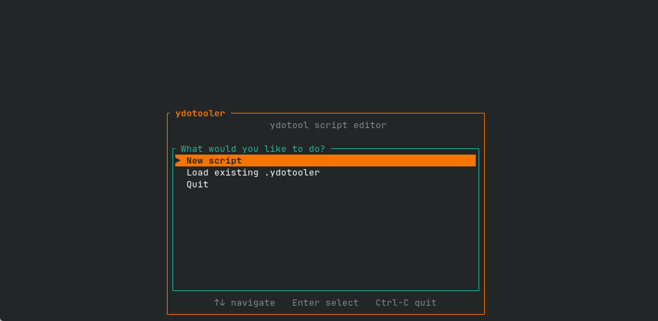
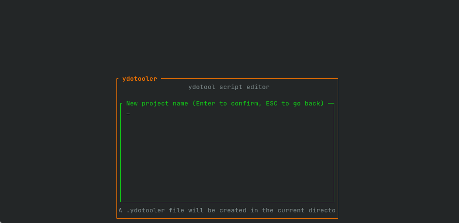
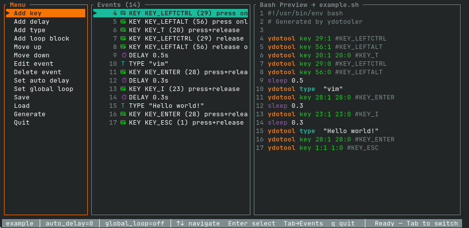
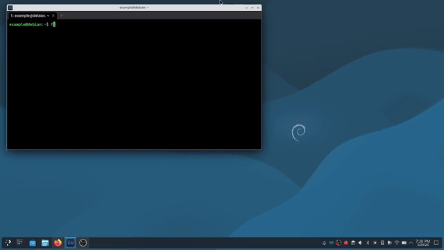
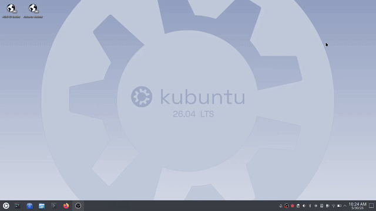

# ydotooler — A TUI Script Builder for [ydotool](https://github.com/ReimuNotMoe/ydotool)
Build [ydotool](https://github.com/ReimuNotMoe/ydotool) automation scripts interactively from your terminal — no manual scripting required.

ydotooler is a terminal-based utility for building [ydotool](https://github.com/ReimuNotMoe/ydotool) scripts without having to write them by hand. It provides a simple, interactive interface for assembling input events and exporting them as ready-to-run Bash scripts.





## Full disclosure

This project started as an experiment while I was learning Rust. I iterated on earlier versions written in bash and python before porting everything over and continuing development here.

I also used AI tools during development, along with a lot of manual debugging and iteration over time.


## Why this exists

Coming from Windows, I was a huge fan of tools like Pulover’s Macro Creator. When switching to Linux, I was always looking for something with similar functionality.

I briefly used xdotool, but with Wayland becoming the default, that path became less viable. That led me to [ydotool](https://github.com/ReimuNotMoe/ydotool)—which works great—but the surrounding ecosystem is still pretty sparse when it comes to user-friendly tooling.

So instead of waiting for something to appear, I built this and decided to share it to hopefully help grow the ecosystem a bit.

## What this tool does

ydotooler is not a replacement for [ydotool](https://github.com/ReimuNotMoe/ydotool). It is only a script generator.
It lets you:

* Build sequences of input events interactively
* Add:
  * Key presses/releases
  * Mouse button clicks (via key events)
  * Delays
  * Text typing
  * Loop blocks (including infinite loops)
* Reorder, edit, duplicate, and delete events
* Preview the generated Bash script in real time
* Save/load projects (.ydotooler format)
* Export executable .sh scripts ready to run

Under the hood, it generates standard [ydotool](https://github.com/ReimuNotMoe/ydotool) commands like:

`ydotool key 30:1 30:0` or `sleep 0.1`

## Requirements
* You must already have [ydotool](https://github.com/ReimuNotMoe/ydotool) installed and properly configured for your system. This includes:
    * ydotoold running (preferably as a background service)
    * Proper permissions depending on your distro/setup

This tool does not handle any of that—it only generates scripts.

* keymap file
    * There is a default one already included, but if your input-event-codes.h is different from default then you will need to use my [bash tool](https://github.com/Mr-Robert-House/ydotooler-keymap) to create a new keymap.

* Build dependencies
    * `rustc` and `cargo` (to build from source)
    * `gcc` (required by the Rust toolchain for linking)
    * On NixOS, running `nix develop` will handle all of the above for you

## Usage

### Startup

When you launch ydotooler you are greeted with a startup menu offering three options: **New script**, **Load existing .ydotooler**, or **Quit**. Use `↑`/`↓` to navigate and `Enter` to confirm.

* **New script** — prompts you for a name. This creates a `<name>.ydotooler` project file and a `<name>.sh` output file.
* **Load existing** — opens a searchable file browser listing all `.ydotooler` files in the current directory. Type to filter, `↑`/`↓` to navigate, `Enter` to open.

### The main interface

The interface is split into three panes:

* **Menu** (left) — actions you can perform
* **Events** (centre) — your current event sequence
* **Bash Preview** (right) — the live script output, scrolled to follow your cursor

A status bar at the bottom shows the project name, current auto-delay, global loop setting, context-sensitive key hints, and the result of the last action.

Use `Tab` to switch focus between the **Menu** and **Events** panes. Press `q` or select **Quit** from the menu to exit.

### Menu pane

Navigate with `↑`/`↓` and press `Enter` to activate an item. The active pane border is highlighted in yellow.

| Menu item | What it does |
|---|---|
| **Add key** | Opens the key/button picker (see below) |
| **Add delay** | Prompts for a delay in seconds (e.g. `0.5`) |
| **Add type** | Prompts for a string to type via `ydotool type` |
| **Add loop block** | Prompts for a repeat count (`0` = infinite); inserts a LOOP / END LOOP pair |
| **Move up / Move down** | Moves the selected event(s) one position |
| **Edit event** | Edit the mode of a key/button, or the value of a delay, type, or loop |
| **Delete event** | Deletes the selected event(s) |
| **Set auto delay** | Adds an automatic `sleep` after every key/type event (`0` = off) |
| **Set global loop** | Wraps the entire script in a repeat loop (`0` = off) |
| **Save** | Saves the project to its `.ydotooler` file |
| **Load** | Reloads the project from disk, discarding unsaved changes |
| **Generate** | Writes the final executable `.sh` script |
| **Quit** | Exits ydotooler |

### Events pane

Navigate with `↑`/`↓`. The active pane border is highlighted in cyan.

| Key | Action |
|---|---|
| `Space` | Toggle multi-select on the current event and advance cursor |
| `k` | Move event (or selection) up |
| `j` | Move event (or selection) down |
| `u` | Duplicate event (or selection) |
| `d` | Delete event (or selection) |
| `Esc` | Clear multi-selection |

### Adding a key or mouse button event

Selecting **Add key** opens a searchable picker backed by the `input-event-codes_edited` keymap file. Type any part of a key name to filter the list, use `↑`/`↓` to navigate, and press `Enter` to select. Press `Esc` to cancel.

After choosing a code you will be asked to pick a **mode**:

* **press+release** — sends a full keypress (down then up). This is what you want most of the time.
* **press only** — sends the key-down event and holds it. Useful for modifier keys like `Ctrl` or `Alt` that need to be held while another key is pressed.
* **release only** — sends the key-up event. Used to release a key that was previously held with *press only*.

#### KEY vs BTN — what's the difference?

All key and mouse button events are sent via the same `ydotool key` command under the hood. ydotooler distinguishes them visually based on the code prefix:

* Codes starting with `KEY_` (e.g. `KEY_A`, `KEY_ENTER`, `KEY_LEFTCTRL`) are keyboard keys. They appear with a ⌨ icon in the events list.
* Codes starting with `BTN_` (e.g. `BTN_LEFT`, `BTN_RIGHT`, `BTN_MIDDLE`) are mouse buttons. They appear with a 🖱 icon. The generated bash command is identical — `ydotool key <code>:1 <code>:0` — the distinction is purely for readability in the editor.

If you have never used [ydotool](https://github.com/ReimuNotMoe/ydotool) directly, this is worth knowing: ydotool treats all input events — keyboard keys and mouse buttons alike — as generic key codes. There is no separate "click" command; a mouse button click is just a key press and release using a `BTN_` code.

### Inline prompts

When an action requires text input (delay value, type string, loop count, etc.) a prompt appears in the status bar at the bottom. Type your value and press `Enter` to confirm, or `Esc` to cancel.

### Workflow summary

1. Launch ydotooler and create or load a project
2. Add events using the Menu pane
3. Reorder or edit events in the Events pane as needed
4. Optionally set an **auto delay** to insert pauses between events automatically
5. Select **Generate** to write the `.sh` script
6. Assign the script to a keyboard shortcut in your desktop environment

## Limitations / Known Issues
* Mouse movement is not implemented
    * I’ve never been able to get reliable mouse movement working with raw [ydotool](https://github.com/ReimuNotMoe/ydotool)
    * It’s possible I’m overlooking something, but for now it’s intentionally excluded
* Relies entirely on [ydotool](https://github.com/ReimuNotMoe/ydotool) behavior
    * Any quirks, delays, or inconsistencies come from [ydotool](https://github.com/ReimuNotMoe/ydotool) itself
    * Running ydotoold as a persistent service is highly recommended

## Project format
Projects are saved as .ydotooler files, which store:

* Event sequences
* Auto-delay settings
* Loop configurations

These can be reloaded and edited later.

## Goal

This is mainly a quality-of-life tool for people using [ydotool](https://github.com/ReimuNotMoe/ydotool) under Wayland. If it saves you from manually writing scripts or helps you prototype faster, it’s doing its job.

## Installation

### From source

_Assuming you are using the default `input-event-codes.h`:_

```bash
git clone https://github.com/Mr-Robert-House/ydotooler
cd ydotooler
cargo build --release
```

### NixOS
If you are on NixOS, make sure to run:
```bash
nix develop
```
before building with Cargo.

## Demo

**CachyOS**


**Debian**


**Fedora**


**Kubuntu**


## **Example**

This is how the the CLI saves your progess, this is not for a human to edit, so don't worry if it looks weird.

```md
#AUTO_DELAY=0
#GLOBAL_LOOP=0
KEY|29|KEY_LEFTCTRL|press only
KEY|56|KEY_LEFTALT|press only
KEY|20|KEY_T|press+release
KEY|29|KEY_LEFTCTRL|release only
KEY|56|KEY_LEFTALT|release only
DELAY|0.5||
TYPE|vim||
KEY|28|KEY_ENTER|press+release
DELAY|0.3||
KEY|23|KEY_I|press+release
DELAY|0.3||
TYPE|Hello world!||
KEY|28|KEY_ENTER|press+release
KEY|1|KEY_ESC|press+release
```

But then when you open that .ydotooler file and generate, this is the result. A ready to run shell script.

```md
#!/usr/bin/env bash
# Generated by ydotooler

ydotool key 29:1 #KEY_LEFTCTRL
ydotool key 56:1 #KEY_LEFTALT
ydotool key 20:1 20:0 #KEY_T
ydotool key 29:0 #KEY_LEFTCTRL
ydotool key 56:0 #KEY_LEFTALT
sleep 0.5
ydotool type "vim"
ydotool key 28:1 28:0 #KEY_ENTER
sleep 0.3
ydotool key 23:1 23:0 #KEY_I
sleep 0.3
ydotool type "Hello world!"
ydotool key 28:1 28:0 #KEY_ENTER
ydotool key 1:1 1:0 #KEY_ESC

```
